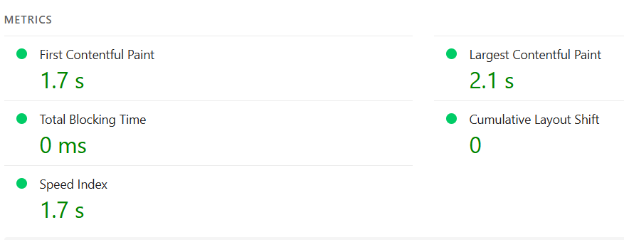

# Harjoitustyö

## Harjoitustyön testaus ja testauksen raportointi
Toimivuutta testasin läppärillä ja puhelimellani. 

### Desktop kokemus
Läppärillä testattaessa sivusto vaikuttaa toimivan ihan näppärästi ja toivotusti. Olen tyytyväine painikkeisiin ja niiden sijainteihin sivustolla. 
Mielestäni sivuston asettelu on toimiva ja ohjaa käyttäjää toimimaan halutusti. Sivustossa jäi kyllä häiritsemään värien valinta. Taustaväri on liian tumma suhteessa fontinväriin. Näitä olisi ollut hyvä vielä säädellä.

### Mobiili kokemus
Responsiivisuus toimii melkohyvin pienien säätöjen jälkeen. Oikealle puolelle jää kuitenkin jokin epäselvä harmaa palkki, jota en ajan puutteen vuoksi ehtinyt enempää selvitellä mistä johtuu. 

## Testaus eri selaimilla

- Google Chrome: Toimii toivotusti.
- Microsoft Edge: Toimivuus ei ero chromesta mitenkään.
- Mozzilla Firefox:
- Safari: Tämä testattu mobiililaitteella. Toimii toivotusti, poislukien harmaa palkki joka jää oikeaan reunaan.

## Latautumisaika
Sivuston latautumisajan testasin käyttäen apunani https://pagespeed.web.dev . Latautumis ajat näyttävät olevan hyvät niin mobiilissa kuin desktopissakin.

### Desktop

### Mobiili

